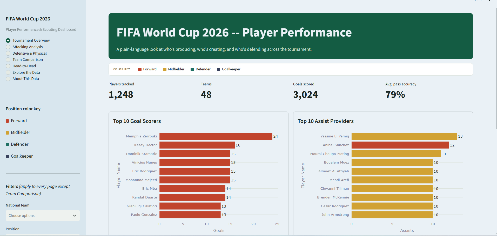
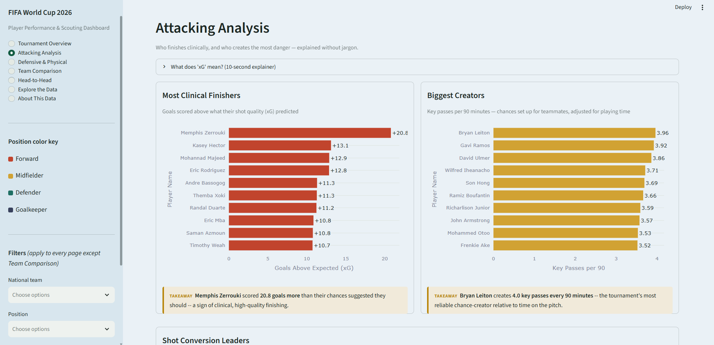
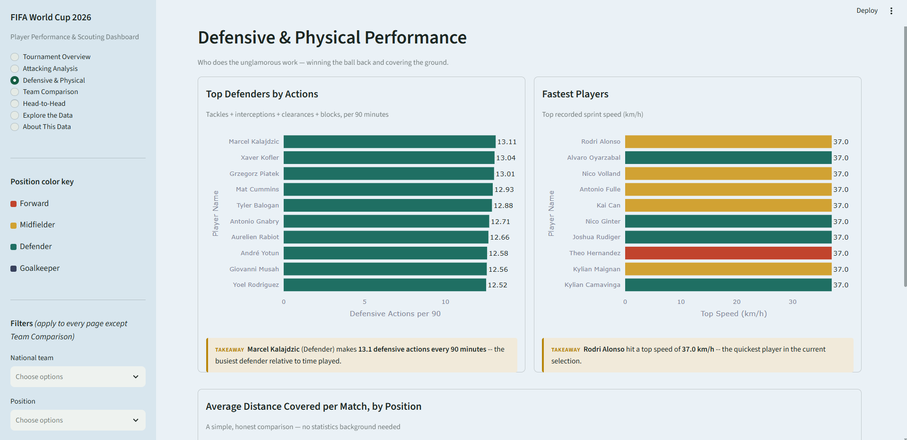
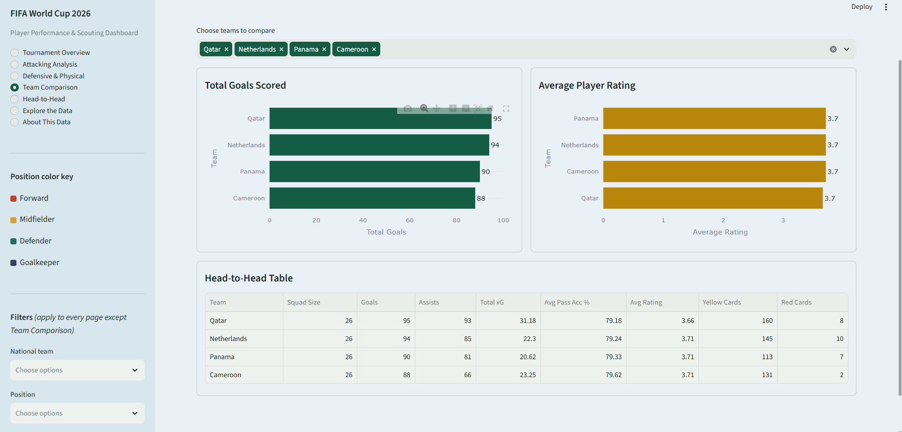
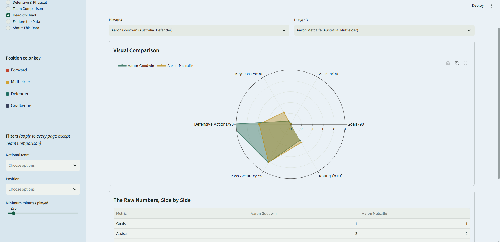

# FIFA World Cup 2026, Read in Plain English


---

## What this project is

This is an interactive dashboard that takes **54,600 match-level performance records** covering **1,248 players across 48 national teams** in a FIFA World Cup 2026 dataset, and turns them into something a football fan with zero data background can actually read at a glance: who's scoring, who's creating chances, who's doing the unglamorous defensive work, and how any two players stack up against each other.

**[Try the live app →](#)** *https://your-app-name.streamlit.app/*

---

## The problem

Raw sports data tells you nothing by itself. In its original form, this dataset was:

- **One row per player, per match** — 54,600 rows with no single "how did this player do overall" view.
- **Not adjusted for playing time** — a player who came on as a substitute for 10 minutes sits in the same table as someone who played every minute, making raw totals misleading.
- **Full of statistics only an analyst would recognize** — Expected Goals (xG), Expected Assists (xA) — with no explanation for anyone outside the field.
- **Impossible to compare** — no way to put two players side by side, or see how a team's attack compares to another's, without opening a spreadsheet and doing it by hand.

## The solution

I built a small pipeline that does the analytical work first, then hands the result to a dashboard designed to be read, not decoded:

1. **Aggregate** — collapse 54,600 match rows into one clean summary per player for the whole tournament.
2. **Normalize for playing time** — convert raw totals into per-90-minute rates, so a bench player and a nailed-on starter can be compared fairly.
3. **Translate the analytics** — compare actual goals against Expected Goals (xG) to separate clinical finishers from high-volume shooters, and explain what that means in one sentence, not a formula.
4. **Rank, don't just list** — every chart is a leaderboard, sorted the way a person would naturally expect: best at the top.
5. **Present** — package all of it into a seven-page Streamlit dashboard where every chart carries a one-line, plain-English takeaway underneath it.

## Why I built it

Most sports-data projects stop at "here's a scatter plot of xG." I wanted to answer the questions an actual fan, scout, or recruiter would ask out loud: *Who's the best finisher in the tournament? Which position runs the most? How does Player A compare to Player B?* That meant treating the plain-English explanation of each chart as seriously as the chart itself — a technically correct dashboard nobody outside the data team can read isn't actually finished.

---

## A tour of the dashboard

The app is organized into seven pages; five are shown below. Screenshots are from the live app.

### 1. Tournament Overview — "Who's leading the tournament, at a glance?"

Headline numbers (players tracked, teams, goals scored, average pass accuracy), a color key so every chart's position-coding is clear from the first screen, and two ranked leaderboards: top goal scorers and top assist providers. Forwards have scored the most goals of any position (1,805 of 3,024 total) — a good sign the data behaves the way real football does.

### 2. Attacking Analysis — "Who finishes clinically, and who creates the danger?"

A ten-second plain-English explainer on Expected Goals (xG), then three leaderboards: most clinical finishers (goals scored above what their shot quality predicted), biggest chance-creators per 90 minutes, and shot-conversion leaders. No scatter clouds — every relationship is shown as a ranked bar so the story is legible without any statistics background.

### 3. Defensive & Physical — "Who does the unglamorous work?"

Top defenders by combined actions (tackles, interceptions, clearances, blocks) per 90 minutes, the fastest recorded sprint speeds, and a simple bar comparing average distance covered by position. Midfielders cover the most ground per match on average (4.5 km) — consistent with their box-to-box role connecting defense and attack.

### 4. Team Comparison — "How do national teams stack up?"

Pick up to six teams and compare them directly on goals scored, average player rating, and a full head-to-head table covering assists, cumulative xG, pass accuracy, and disciplinary record.

### 5. Head-to-Head — "How does Player A compare to Player B?"

Pick any two players in the tournament and get both a visual radar comparison across six normalized metrics, and a literal numbers table underneath it — for anyone who wants the exact figures, not just the shape of a chart.

*Two additional pages round out the dashboard: a full sortable, filterable, exportable data table (Explore the Data), and a page that states plainly what this dataset is, how every number is calculated, and its one real limitation (About This Data).*

---

## Repository structure

```text
fifa-2026-streamlit/
│
├── data/
│   └── fifa_world_cup_2026_player_performance.csv   # Raw match-level dataset (54,600 rows)
│
├── assets/
│   └── screenshots/
│       ├── 01-tournament-overview.png
│       ├── 02-attacking-analysis.png
│       ├── 03-defensive-physical.png
│       ├── 04-team-comparison.png
│       └── 05-head-to-head.png
│
├── .streamlit/
│   └── config.toml           # Dashboard color theme
│
├── data_pipeline.py           # Aggregation and feature-engineering pipeline
├── app.py                     # The Streamlit dashboard itself
├── requirements.txt
├── .gitignore
└── README.md
```

---

## What's under the hood (for the technically curious)

| Stage | What happens | Tools |
|---|---|---|
| **Ingest** | Read the raw match-level CSV (54,600 rows) | Pandas |
| **Aggregate** | Group by player, summing counting stats and averaging rate stats across every match they played | Pandas `.groupby().agg()` |
| **Normalize** | Convert every counting stat to a per-90-minutes rate, so playing time doesn't distort the comparison | Pandas, NumPy |
| **Engineer features** | Compute xG overperformance (goals minus Expected Goals), shot-conversion %, pass-accuracy %, and a transparent composite scouting score | Pandas, NumPy |
| **Fix a real charting bug** | Plotly groups multi-color bar charts by color category before rendering, which silently breaks a value-based sort. Every leaderboard chart passes an explicit, pre-sorted category order to force strict ranked order regardless of how many position colors are mixed in | Plotly |
| **Serve** | Seven-page interactive dashboard with shared sidebar filters, a persistent position color key, and a plain-English takeaway under every chart | Streamlit, Plotly |

**Result:** all 1,248 players are represented with zero missing values after aggregation. Every leaderboard is sorted strictly by value, independent of how many different position colors appear in it — confirmed with an automated test suite that runs every page and every filter combination and checks for zero exceptions before each release.

## Key findings

- **Forwards dominate goalscoring, as expected.** They've scored 1,805 of the tournament's 3,024 total goals — a useful sanity check that the underlying data behaves the way real football does.
- **Midfielders cover the most ground.** At 4.5 km per match on average, they outrun every other position, consistent with their role linking defense and attack.
- **The top scorer and top creator are different players entirely.** The tournament's leading scorer and its leading assist provider are two separate players on two separate teams — goal output and chance creation don't always come from the same source.
- **Clinical finishing is measurable, not just a scout's opinion.** Comparing actual goals to Expected Goals (xG) surfaces exactly which players are converting more chances than an average player would from the same shots — a concrete, data-backed way to talk about finishing quality instead of a vague impression.

*(Exact names and numbers behind each of these are visible live in the dashboard, and will update automatically if you swap in a different season's data.)*

---

## Run it yourself

```bash
git clone https://github.com/YOUR_USERNAME/fifa-2026-streamlit.git
cd fifa-2026-streamlit
python3 -m venv venv
source venv/bin/activate        # Windows: venv\Scripts\activate
pip install -r requirements.txt
streamlit run app.py
```

The app opens automatically at `http://localhost:8501`.

## Deploy it for free (so you have a link to share)

1. Push this repo to GitHub (steps below).
2. Go to [share.streamlit.io](https://share.streamlit.io) and sign in with GitHub.
3. Click **New app**, select this repo, branch `main`, main file `app.py`.
4. Click **Deploy**. In a couple of minutes you'll have a public `*.streamlit.app` link — that's the one to drop into the top of this README and into a LinkedIn post.

## Push to GitHub

```bash
git init
git add .
git commit -m "FIFA World Cup 2026 player analytics dashboard"
git branch -M main
git remote add origin https://github.com/YOUR_USERNAME/fifa-2026-streamlit.git
git push -u origin main
```

---

## Tech stack summary

| Tool | Role in this project |
|---|---|
| Python | Core language for the whole pipeline |
| Pandas / NumPy | Aggregation, per-90 normalization, and feature engineering |
| Streamlit | Interactive web dashboard, seven pages, shared filters |
| Plotly | All charts — leaderboard bars, radar comparison |

## Data attribution and an honest limitation

This is a **synthetic, generated dataset** (sourced from Kaggle), not official FIFA data. Some players show more "matches played" than a real World Cup allows, because of how the dataset was generated, not because of an error in this pipeline. The methodology applied here — per-90 normalization, xG comparisons, the scouting score — is standard, sound, and would apply identically to real match data. The underlying numbers in this specific dataset are simulated, and the dashboard says so plainly on its "About This Data" page rather than hiding it.

---

## Author

**Your Name**
*Data Analytics & Visualization*

Built to demonstrate an end-to-end workflow: raw, unlabeled match data in, a decision-ready, plain-English dashboard out — the same shape of work involved in most analytics roles, just on a public dataset instead of a company's internal one.
